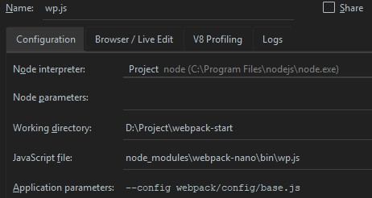

### Say something? emm...
About this project:
- webpack4 + react + mobx-react
- write a webpack plugin
- any element size width sprite image

### Directory
```
.
├── package.json
├── postcss.config.js
├── readme.md
├── screenshot
│   └── 0.jpg
├── src
│   ├── assets
│   │   ├── fav.ico
│   │   └── images
│   │       ├── raw
│   │       │   ├── logo01.png
│   │       │   └── logo02.png
│   │       ├── sp.png              // auto generated
│   │       └── sprite
│   │           ├── logo01.png
│   │           ├── logo02.png
│   │           ├── logo03.png
│   │           └── logo04.png
│   ├── components  
│   │   ├── Home.js
│   │   ├── Sprite.js              // an example for sprite image
│   │   └── Router.js               
│   ├── index.html
│   ├── index.js
│   ├── routes.js
│   ├── stores
│   │   └── store.js
│   └── styles
│       ├── index.scss
│       └── _sprite.scss            // auto generated
├── webpack
│   ├── config
│   │   ├── base.js
│   │   ├── dev.js
│   │   └── pro.js
│   ├── plugins
│   │   └── sprites                 // an example for webpack plugin
│   │       ├── index.js
│   │       ├── scssTemp.js       // template to generate _sprite.scss
│   │       └── jsTemp.js         // template to generate sprite.js
│   └── serv.js
├── webpack-start.iml
└── yarn.lock
```

 
### Debug webpack width webpack-nano in idea


##### [webpack-nano](https://github.com/shellscape/webpack-nano " ")
 Usage:
```
$ npx wp --help

  Usage
    $ wp [...options]

  Options
    --config          A path to a webpack config file
    --config.{name}   A path to a webpack config file, and the config name to run
    --help            Displays this message
    --silent          Instruct the CLI to produce no console output
    --version         Displays webpack-nano and webpack versions

  Examples
    $ wp
    $ wp --help
    $ wp --config webpack.config.js
    $ wp --config.serve webpack.config.js
```    

### Write a Webpack Plugin
Here is an example for how to write a webpack plugin. 

#####  sprites image
Usage:
```
// webpack config
new SpritesPlugin({
    scssPath: '_sprite.scss',              // default 
    jsPath: '_sprite.scss',              // default 
    base: './src/styles',                  // default 
    source: { 
        '../assets/images/sp':             // output  ./src/styles/assets/images/sp.png          
           '../assets/images/sprite/*.png' // target files or dirs
    },
}),

// scss file
.c{
  @include sprite($logo02,30px)
}
.d{
  @include sprite($logo02)
}

// css output
.c {
    background-size: 126.66667% auto;
    width: 30px;
    height: 30.33333px
}

.c, .d {
    background-image: url(../images/sp.3d69411c.png);
    background-position: 0 0
}

.d {
    width: 90px;
    height: 91px
}
```